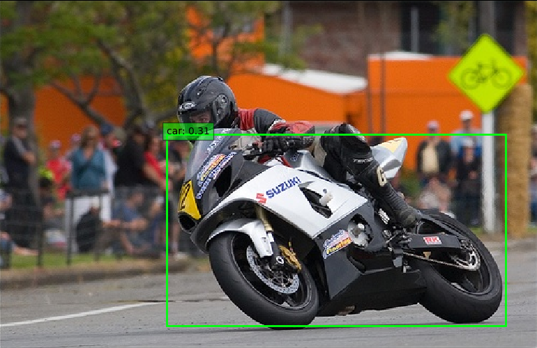
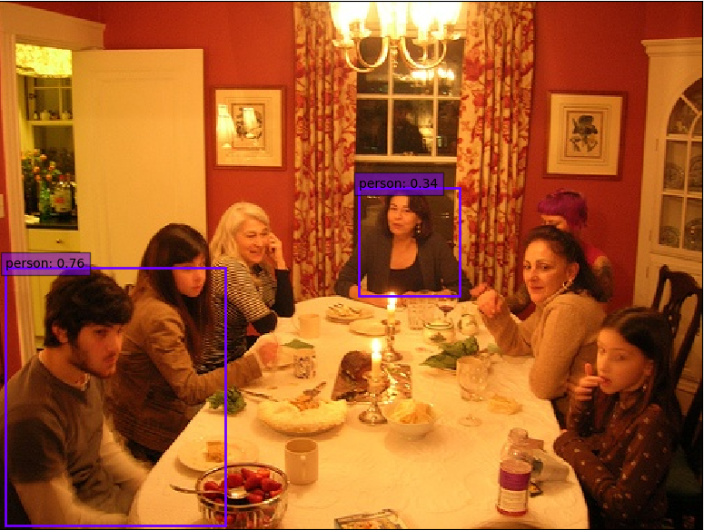
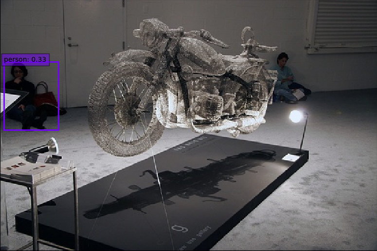

# MobileNet_V3_SSD.pytorch
## Install

1. Install [PyTorch](http://pytorch.org/) 1.0 are command.
2. Clone this repository.(Note: We currently only support Python 3+.)
3. git clone https://github.com/chuliuT/MobileNet_V3_SSD.pytorch.git

## Examples







## Dataset

To make things easy, we provide bash scripts to handle the dataset downloads and setup for you.  We also provide simple dataset loaders that inherit `torch.utils.data.Dataset`, making them fully compatible with the `torchvision.datasets` [API](http://pytorch.org/docs/torchvision/datasets.html).


### COCO
Microsoft COCO: Common Objects in Context

##### Download COCO 2014
```Shell
# specify a directory for dataset to be downloaded into, else default is ~/data/
sh data/scripts/COCO2014.sh
```

### VOC Dataset
PASCAL VOC: Visual Object Classes

##### Download VOC2007 trainval & test
```Shell
# specify a directory for dataset to be downloaded into, else default is ~/data/
sh data/scripts/VOC2007.sh # <directory>
```

##### Download VOC2012 trainval
```Shell
# specify a directory for dataset to be downloaded into, else default is ~/data/
sh data/scripts/VOC2012.sh # <directory>
```

## Training SSD
- To train SSD using the train script simply specify the parameters listed in `train.py` as a flag or manually change them.

```Shell
python3 train.py
```

## Evaluation
To evaluate a trained network:

```Shell
python3 eval.py
```

## Performance

#### VOC2007 Test

##### mAP

| Original | Converted weiliu89 weights | From scratch w/o data aug | From scratch w/ data aug |
| :------: | :------------------------: | :-----------------------: | :----------------------: |
|  77.2 %  |            None            |           None            |          49.26%          |

##### FPS(there have some unknown bugs)
###### cpu:5 fps

## Demos

```
cd demo
python3 demo.py
```

## Camera

```
cd demo
python3 live.py
```

## ***Note:*** Unfortunately, Mean-ap is too low,the fps measurement is worst

## Code References：

https://github.com/kuan-wang/pytorch-mobilenet-v3

https://github.com/songwsx/steel-detect

https://github.com/amdegroot/ssd.pytorch

-- update date 2019.12.09

add modified training code

-- update date 2019.12.11

fix a model bug in test mode

VOC07 metric? Yes
AP for aeroplane = 0.6109
AP for bicycle = 0.5853
AP for bird = 0.3183
AP for boat = 0.3695
AP for bottle = 0.1458
AP for bus = 0.6241
AP for car = 0.6528
AP for cat = 0.5913
AP for chair = 0.2562
AP for cow = 0.4363
AP for diningtable = 0.5608
AP for dog = 0.5212
AP for horse = 0.6694
AP for motorbike = 0.6020
AP for person = 0.5571
AP for pottedplant = 0.1620
AP for sheep = 0.4627
AP for sofa = 0.5607
AP for train = 0.6718
AP for tvmonitor = 0.4945
Mean AP = 0.4926

Results computed with the **unofficial** Python eval code.

Results should be very close to the official MATLAB eval code.

-- update date 2019.12.12

